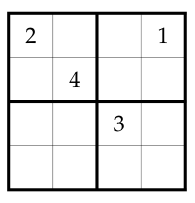
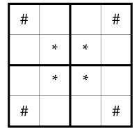

# Investigate!

A **mini sudoku puzzle** is a 4 x 4 grid of squares, divided into four 2 x 2
boxes. The goal is to fill each square with a digit from 1 to 4, such that no
digit repeats in any row, any column, or any box.

Here is a simple mini sudoku puzzle you can try to solve.

You might notice that the solution to the above puzzle has its four outside
corners all different, and its four middle squares all different.

The goal of this _Investigate!_ question is to prove that this is not a
coincidence: Suppose a mini sudoku puzzle has all different numbers in its four
corners (marked with # below). Prove that the center four squares (marked with *
below) must also contain different numbers.

## Try it. 1.4.1

Try placing numbers into an empty mini sudoku puzzle. See if you can break the
statement we were asked to prove in the _Investigate!_ activity. What stops you?
Briefly explain whether you think the statement is true or false, and why.

A:

I think the statement is true. When I tried to make two of the middle squares
the same number, the sudoku rules forced a contradiction because the numbers
would repeat in a row, column, or box. The different corners seem to force the
middle squares to all be different too.
